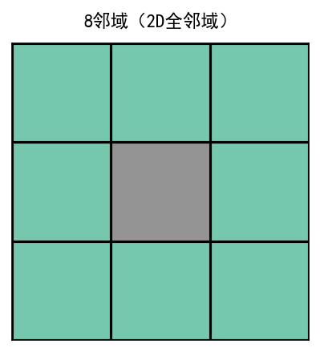
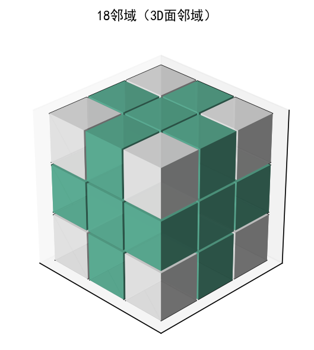

## bwareaopen  
删除二值图像中的小目标

## 简介  
[ `BW2 = bwareaopen(BW, P)`](#function1)  
[ `BW2 = bwareaopen(BW, P, conn)`](#function2)

## 用法  
<a id="function1"></a>
[BW2](#Q1) = bwareaopen([BW](#Q2), [P](#Q3)) 从二值图像 [`BW`](#Q2) 中删除少于 [`P`](#Q3) 个像素的所有连通分量（对象），并生成另一个二值图像 [`BW2`](#Q1) ，此运算称为面积开运算。
<a id="function2"></a>  
[BW2](#Q1) = bwareaopen([BW](#Q2), [P](#Q3), [conn](#Q4)) 删除所有连通分量，其中 [`conn`](#Q4) 指定所需的连通性。

## 参数说明  
### 输入参数  

**<a id="Q2"></a>BW — 二值图像**  
逻辑数组 | 数值数值

- 仅支持二维的逻辑数组或数值数组；
- 若为逻辑数组，true 表示目标像素，false 表示背景像素；
- 若为数值数组，非零元素视为目标像素，零元素视为背景像素。

**数据类型：** `logical` | `single` | `double` | `uint8` | `uint16` | `uint32` 

**<a id="Q3"></a>P — 对象的最大像素数**  
非负整数

对象的最大像素数，指定为非负整数。

**示例：** 50  
**数据类型：** `double`

**<a id="Q4"></a>conn — 像素连通性**  
4 | 8 | 6 | 18 | 26

像素连通性，指定为下表中的值之一:

| **值** | **意义** | **图示** |
|:--|:--|:--|
| <th colspan=3 align="left">二维连通</th> |
| 4 |如果像素的边缘相互接触，则这些像素具有连通性，如果两个相邻像素都为 on 并在水平或垂直方向上连通，则它们是同一对象的一部分。| <br>当前像素以灰色显示。|
| 8 |如果像素的边缘或角相互接触，则这些像素具有连通性，如果两个相邻像素都为 on 并在水平、垂直或对角线方向上连通，则它们是同一对象的一部分。| <br>当前像素以灰色显示。|
| <th colspan=3 align="left">三维连通</th> |
| 6 | 如果像素的面接触，则这些像素具有连通性。如果两个相邻像素都为 on 并以如下方式连通，则它们是同一目标的一部分：<br>在所列方向之一上连通：内、外、左、右、上、下<br>| <br>当前像素是立方体的中心。|
| 18 |如果像素的面或边缘接触，则这些像素具有连通性。如果两个相邻像素都为 on 并以如下方式连通，则它们是同一目标的一部分：<br>在所列方向之一上连通：内、外、左、右、上、下<br>在两个方向的组合上连通，如右下或内上| <br>当前像素是立方体的中心。|
| 26 | 如果像素的面、边缘或角接触，则这些像素具有连通性。如果两个相邻像素都为 on 并以如下方式连通，则它们是同一目标的一部分：<br>在所列方向之一上连通：内、外、左、右、上、下<br>在两个方向的组合上连通，如右下或内上<br>在三个方向的组合上连通，如内右上或内左下 |  <br>当前像素是立方体的中心。|

**数据类型：** `double` | `logical`

### 输出参数  
**<a id="Q1"></a>BW2 — 面积开运算后的图像**  
逻辑数组

面积开运算后的图像，以与 [`BW`](#Q2) 大小相同的逻辑数组形式返回。

## 算法  
基本步骤如下
 1. 确定连通分量：
```
CC = bwconncomp(BW, conn);
```
 2. 计算每个分量的面积：
```
S = regionprops(CC, 'Area');
```
 3. 删除小对象：
```
L = labelmatrix(CC);
BW2 = ismember(L, find([S.Area] >= P));
```

## 版本历史  
在北太天元图像处理工具箱 V1.1 推出

## 相关主题  
<a href="../bwconncomp/bwconncomp.html">bwconncomp</a> | <a
href="../conndef/conndef.html">conndef</a>