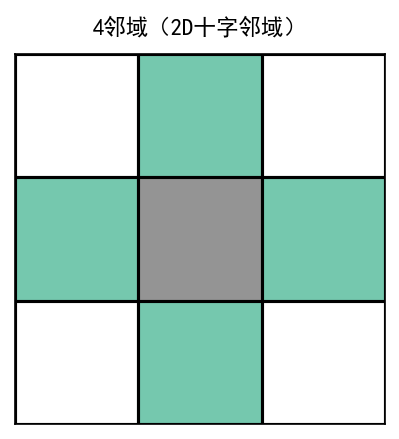
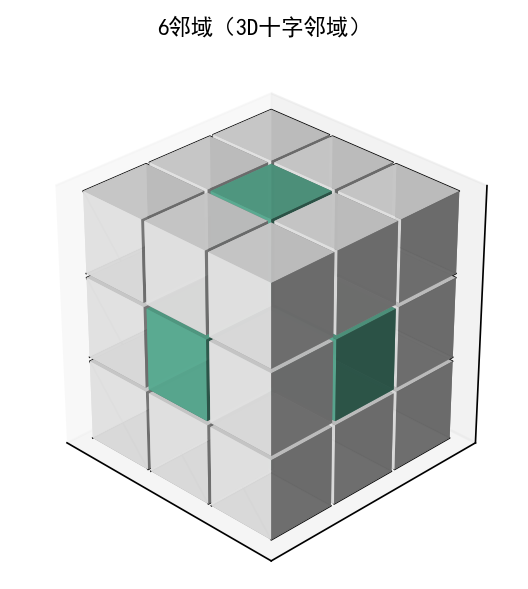
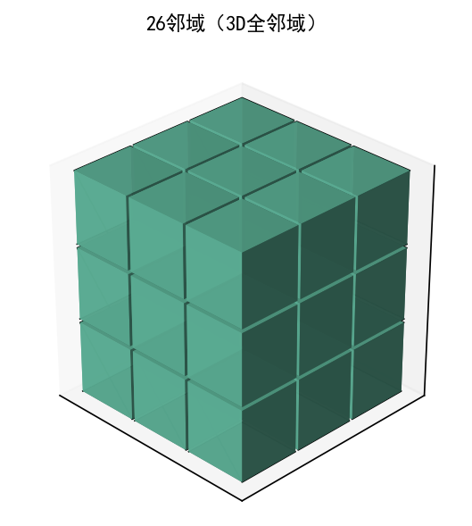

## bwconncomp  
查找二值图像中的连通分量并对其计数

## 简介  
[ `CC = bwconncomp(BW)`](#function1)  
[ `CC = bwconncomp(BW, conn)`](#function2)

## 用法  

[CC](#Q1) = bwconncomp([BW](#Q2)) 查找二值图像 [`BW`](#Q2) 中的连通分量 [`CC`](#Q1) 并对其计数，[`CC`](#Q1) 输出结构体包含输入图像尺寸，图像中连通分量（如感兴趣区域 (ROI)）的总数，以及分配给每个分量的像素索引。bwconncomp 对二维图像使用默认 8 连通。
  
[CC](#Q1) = bwconncomp([BW](#Q2), [conn](#Q3)) 为连通分量指定期望的 [`conn`](#Q3) 连通。

## 参数说明  
### 输入参数  

**BW — 二值图像**  
数值数组 | 逻辑数组

二值图像，指定为任意维度的数值或逻辑数组。

- 若为逻辑数组，true 表示目标像素，false 表示背景像素；
- 若为数值数组，非零元素视为目标像素，零元素视为背景像素。

**数据类型：** `single` | `double` | `int8` | `int16` | `int32` | `int64` | `uint8` | `uint16` | `uint32` | `uint64` | `logical`

**conn — 像素连通性**  
4 | 8 | 6 | 18 | 26

像素连通性，指定为下表中的值之一:

| **值** | **意义** | **图示** |
|:--|:--|:--|
| <th colspan=3 align="left">二维连通</th> |
| 4 |如果像素的边缘相互接触，则这些像素具有连通性，如果两个相邻像素都为 on 并在水平或垂直方向上连通，则它们是同一对象的一部分。|  当前像素以灰色显示。|
| 8 |如果像素的边缘或角相互接触，则这些像素具有连通性，如果两个相邻像素都为 on 并在水平、垂直或对角线方向上连通，则它们是同一对象的一部分。|  当前像素以灰色显示。|
| <th colspan=3 align="left">三维连通</th> |
| 6 | 如果像素的面接触，则这些像素具有连通性。如果两个相邻像素都为 on 并以如下方式连通，则它们是同一目标的一部分： 在所列方向之一上连通：内、外、左、右、上、下 |  当前像素是立方体的中心。|
| 18 |如果像素的面或边缘接触，则这些像素具有连通性。如果两个相邻像素都为 on 并以如下方式连通，则它们是同一目标的一部分： 在所列方向之一上连通：内、外、左、右、上、下 在两个方向的组合上连通，如右下或内上|  当前像素是立方体的中心。|
| 26 | 如果像素的面、边缘或角接触，则这些像素具有连通性。如果两个相邻像素都为 on 并以如下方式连通，则它们是同一目标的一部分： 在所列方向之一上连通：内、外、左、右、上、下 在两个方向的组合上连通，如右下或内上 在三个方向的组合上连通，如内右上或内左下 |   当前像素是立方体的中心。|

**数据类型：** `double` | `logical`

### 输出参数  
**CC — 连通分量**  
结构体

连通分量，以具有四个字段的结构体形式返回：

| **字段** | **描述** |
|:-|:-|
| Connectivity | 连通分量（对象）的连通性 |
| ImageSize | 二值图像的大小 |
| NumObjects |  二值图像中连通分量（对象）的数量 |
| PixelIdxList |  1xNumObjects 的单元数组，其中单元数组中的第 k 个元素是一个向量，包含第 k 个对象中像素的线性索引。 |

## 版本历史  
在北太天元图像处理工具箱 V1.0 推出

## 相关主题  
<a href="../bwlabel/bwlabel.html">bwlabel</a> | <a 
href="../bwlabeln/bwlabeln.html">bwlabeln</a> | <a 
href="../labelmatrix/labelmatrix.html">labelmatrix</a> | <a 
href="../regionprops/regionprops.html">regionprops</a>