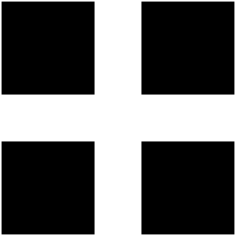
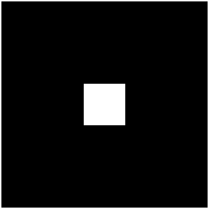
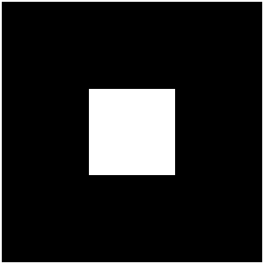
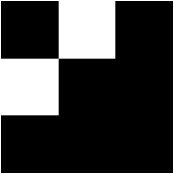
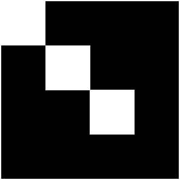
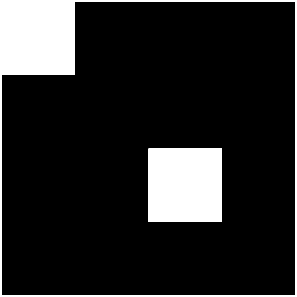
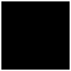
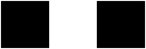
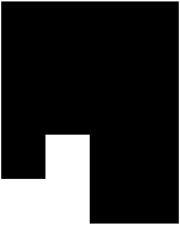

## bwmorph 
二值图像形态学运算

## 简介
[ `BW2 = bwmorph(BW, operation)`](#function1)  
[ `BW2 = bwmorph(BW, operation, n)`](#function2)

## 用法

[BW2](#Q4) = bwmorph([BW](#Q1), [operation](#Q2)) 对二值图像 `BW` 应用特定的形态学运算，其中 `operation` 可以为bothat，branchpoints，bridge，clean，close，diag，endpoints，fill，hbreak，majority，open，remove，shrink，skel，spur，thicken，thin，tophat 其中之一。  

[BW2](#Q4) = bwmorph([BW](#Q1), [operation](#Q2), [n](#Q3)) 应用 `n` 次运算。`n` 可以是 `Inf`，在这种情况下会一直重复运算，直到图像不再变化。

## 参数说明
### 输入参数
** BW — 二值图像**  
二维数值矩阵 | 二维逻辑矩阵

二值图像，指定为二维数值矩阵或二维逻辑矩阵。对于数值输入，任何非零像素都被视为 1 (true)。

** operation — 要执行的形态学运算**  
字符向量 | 字符串标量

要执行的形态学运算，指定为下列项之一。

|操作|描述|
|:-|:-|
|bothat|执行形态学“底帽”运算，返回原图像减去执行形态学闭运算之后得到的图像。bwmorph 函数使用邻域 ones(3) 执行形态学闭运算。如果要使用不同邻域执行形态学底帽运算，则请使用 imbothat 函数。|
|branchpoints|找到骨架的分支点。例如： becomes |注意：要找到分支点，图像必须骨架化。要创建骨架化图像，请使用 bwmorph(BW,"skel")。|
|bridge|桥接未连通的像素，即如果 0 值像素有两个未连通的非零邻点，则将这些 0 值像素设置为 1。例如： becomes   |
|clean|删除孤立像素（由 0 包围的单个 1）。|
|close|执行形态学闭运算（先膨胀后腐蚀）。 bwmorph 函数使用邻域 ones(3) 执行形态学闭运算。如果要使用不同邻域执行形态学闭运算，则请使用 imclose 函数。|
|diag|使用对角填充以消除背景的 8 连通。例如： becomes |
|endpoint|找到骨架的终点。例如：  becomes 注意：要找到终点，图像必须骨架化。要创建骨架化图像，请使用 bwmorph(BW,"skel")。|
|fill|填充孤立的内部像素（由 1 包围的单个 0）。|
|hbreak|删除具有 H 连通的像素。例如： becomes |
|majority|如果像素的 3×3 邻域中有 5 个或更多像素为 1，则将像素设置为 1；否则，将像素设置为 0。|
|open|执行形态学开运算（先腐蚀后膨胀）。bwmorph 函数使用邻域 ones(3) 执行形态学开运算。如果要使用不同邻域执行形态学开运算，则请使用 imopen 函数。|
|remove|删除内部像素。如果一个像素的所有 4 连通邻点均为 1，则此选项会将该像素设置为 0，因此只保留边界像素为 on。|
|shrink|使用 n = Inf，通过从对象边界删除像素，将对象收缩为点。使没有孔洞的对象收缩为点，有孔洞的对象收缩为每个孔洞和外边界之间的连通环。此选项保留欧拉数（也称为欧拉示性数）。|
|skel|使用 n = Inf，删除对象边界上的像素，而不允许对象分裂。其余的像素构成图像骨架。此选项会保留欧拉数。在使用三维体时，或当您要对骨架剪枝时，请使用 bwskel 函数。|
|spur|删除杂散像素。例如： becomes |
|thicken|在 n = Inf 时，通过向对象外部添加像素来加厚对象，直到先前未连通的对象实现 8 连通为止。此选项会保留欧拉数。
|thin|在 n = Inf 时，通过从对象边界删除像素，将对象收缩为线。使没有孔洞的对象收缩为具有最小连通性的线，有孔洞的对象收缩为每个孔洞和外边界之间的连通环。此选项会保留欧拉数。有关详细信息，请参阅算法。
|tophat|	执行形态学“顶帽”运算，返回原图像减去执行形态学开运算之后得到的图像。bwmorph 函数使用邻域 ones(3) 执行形态学开运算。如果您要对不同邻域执行形态学顶帽运算，则请使用 <a href="../imtophat/imtophatr.html">imtophat</a> 函数。|

** n — 执行运算的次数**  
正整数 | Inf

执行运算的次数，指定为正整数或 `Inf`。当您将 `n` 指定为 `Inf` 时，`bwmorph` 函数会重复该运算，直到图像不再变化。

**示例**： 100

**数据类型**： `single` | `double` | `uint8` | `uint16` | `int8` | `int16` 

### 输出参数
** BW2 — 执行形态学运算后的图像**  
二维逻辑矩阵

执行形态学运算后的图像，以二维逻辑矩阵形式返回。

**数据类型**： `logical`

## 参考文献
[1] Haralick, Robert M, Linda G Shapiro. Computer and Robot Vision[M].Readingtown, Massachusetts: Addison-Wesley, 1992.   
[2] Kong, T Yung, Azriel Rosenfeld. Topological Algorithms for Digital Image Processing, Amsterdam: Elsevier Science, 1996.   
[3] Lam, L, Seong-Whan Lee,  Ching Y Suen. Thinning Methodologies-A Comprehensive Survey. IEEE Transactions on Pattern Analysis and Machine Intelligence, 1992, 14(9): 879.  
[4] Pratt, William K. Digital Image Processing, New Jersey, USA: John Wiley & Sons, 1991. 

## 版本历史 
在北太天元图像处理工具箱 V1.0 推出

## 相关主题
<a href="../bweuler/bweuler.html">bweuler</a> | <a 
href="../bwskel/bwskel.html">bwskel</a> | <a 
href="../imdilate/imdilate.html">imdilate</a> | <a 
href="../imerode/imerode.html">imerode</a> 

