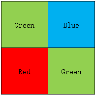
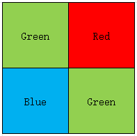
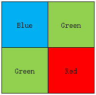
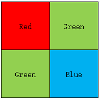

## demosaic
将 Bayer 图像转换为 RGB 图像

## 简介
[`RGB = demosaic(bayer, sensorAlignment)`](#function1)  

## 用法

[RGB](#P1) = demosaic([bayer](#Q1), [sensorAlignment](#Q2)) 将 Bayer 图像转换为 RGB 图像。参数 sensorAlignment 用于指定 Bayer 阵列的排列模式。

Bayer filter mosaic 是一种颜色滤波阵列（Color Filter Array, CFA），即在单芯片数码相机的光敏传感器上按一定规律排列的彩色滤光片。该滤光片阵列使每个感光单元仅记录红、绿或 蓝三者之一的强度信息。Bayer 模式是上述四个彩色滤波单元在空间上周期性重复的排列方式，其基本单元为 2×2，其中包含两个绿色滤波单元、一个红色滤波单元和一个蓝色滤波单元，共同构成 Bayer filter mosaic。

Bayer 图像是由带 Bayer filter mosaic 的相机采集得到的图像。对 Bayer 图像执行去马赛克 (demosaicing) 的过程，本质上是将各感光单元采集到的单通道采样信号进行插值与融合，得到具有三个通道的真彩色图像，而不是单通道的强度图像。

## 参数说明
### 输入参数
** bayer — Bayer 模式编码图像**  
m×n 数值数组

Bayer 模式编码图像，指定为 m×n 的数值数组。bayer 的行数与列数均必须不少于 5，以满足插值与边界处理所需的最小尺寸要求。

**数据类型：** `uint8` | `uint16` | `uint32`

** sensorAlignment — 传感器阵列排列模式**  
"gbrg" | "grbg" | "bggr" | "rggb"

Bayer 阵列排列模式，指定为下表中的一个取值。每个取值通过描述图像左上角 2×2 像素块（按从左到右、从上到下的顺序）对应的颜色传感器排列，来表示红、绿、蓝采样位置的顺序。

| 模式 | 2×2 传感器排列 |
| :----------- | :----------- |
| "gbrg" |  |
| "grbg" |  |
| "bggr" |  |
| "rggb" |  |

**数据类型：** `char` | `string` 

### 输出参数
** RGB — RGB 图像**  
m×n×3 数值数组

RGB 图像，返回为 m×n×3 的数值数组，其数据类型与输入 bayer 保持一致。

## 算法
demosaic 函数采用梯度校正的线性插值方法，将二维 Bayer 单通道图像转换为三通道真彩色图像。

## 参考
[1] Malvar, H.S., L. He, and R. Cutler, High quality linear interpolation for demosaicing of Bayer-patterned color images. ICASPP, Volume 34, Issue 11, pp.2274-2282, May 2004.

## 版本历史
在北太天元图像处理工具箱 V3.0 推出

## 相关主题
<a href="../raw2planar/raw2planar.html">raw2planar</a> | <a
href="../raw2rgb/raw2rgb.html">raw2rgb</a> | <a
href="../rawread/rawread.html">rawread</a> 

