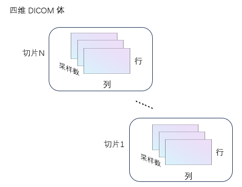
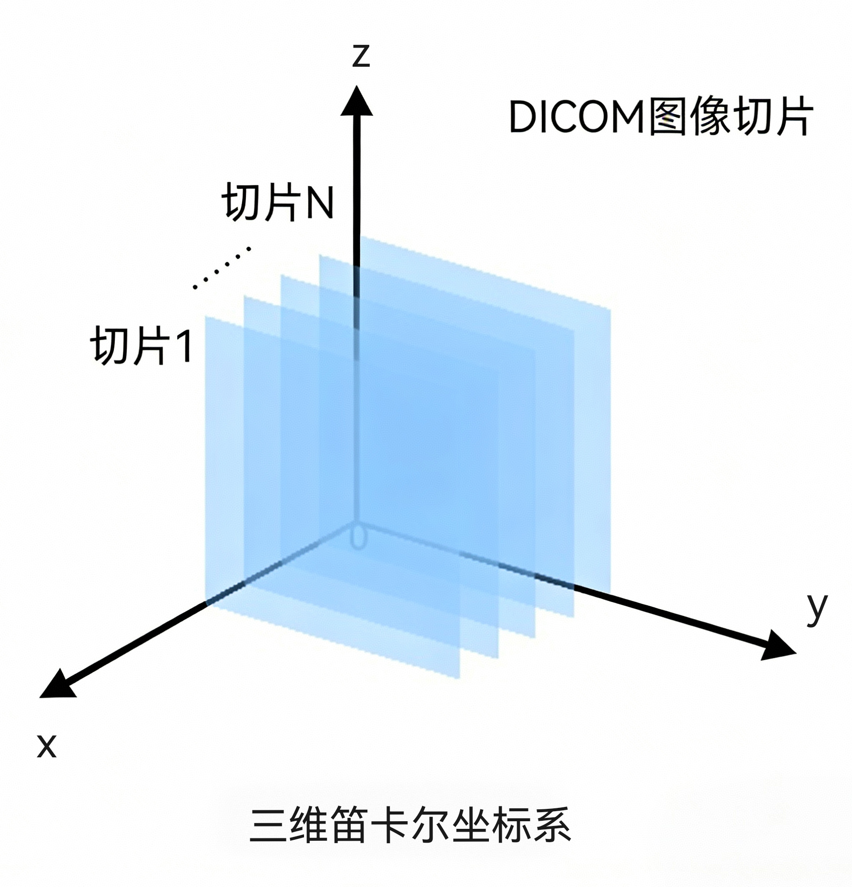

## dicomreadVolume
从一组 DICOM 图像创建四维体数据

## 简介
[`V = dicomreadVolume(source)`](#function1)  
[`V = dicomreadVolume(___, "MakeIsotropic", tf)`](#function2)  
[`[V, spatial] = dicomreadVolume(___)`](#function3)  
[`[V, spatial, dim] = dicomreadVolume(___)`](#function4)

## 用法

[V](#Q1) = dicomreadVolume([source](#P1)) 可根据输入参数 source 所指定的一组 DICOM 文件，创建一个四维体数据 V。该函数会自动对四维体数据中的图像切片进行排序，确保其顺序正确。  

[V](#Q1) = dicomreadVolume(\_\_\_, "MakeIsotropic", [tf](#P2)) 利用前述语法中的任意输入参数组合，从输入的 DICOM 图像数据创建一个各向同性的四维 DICOM 体数据。当输入数据为各向异性的 DICOM 图像序列时，可使用此语法创建各向同性的 DICOM 体数据。  

[[V](#Q1), [spatial](#Q2)] = dicomreadVolume(\_\_\_) 这种调用形式还会额外返回一个结构体 spatial，该结构体描述了输入 DICOM 数据的空间位置、分辨率以及空间朝向信息。  

[[V](#Q1), [spatial](#Q2),[dim](#Q3)] = dicomreadVolume(\_\_\_)在上述功能基础上，额外返回一个维度索引 dim。该索引指向输入 DICOM 数据中，相邻切片之间偏移量最大的那个维度。

## 参数说明
### 输入参数
** source — 体数据文件夹或文件**  
字符串标量 | 字符向量 | 字符串数组 | 字符向量元胞数组

体数据文件夹或文件，指定为字符串标量、字符向量、字符串数组或字符向量元胞数组。

**数据类型：** `char` | `string`  

** tf — 创建各向同性体数据**  
0 (默认值) | 1  

指定是否创建各向同性体数据，取值为逻辑值 0 (false) 或 1 (true)。  

- 0：直接从输入数据创建一个 四维 DICOM 体数据，不进行各向同性处理。
- 1：创建一个各向同性的 四维 DICOM 体数据。 
 
由 `source` 指定的输入数据可以是各向同性的，也可以是各向异性的 DICOM 数据。

### 输出参数
** V — 四维 DICOM 体数据**  
数值数组

四维 DICOM 体数据，以数值数组形式返回。V 的维度为 [行数, 列数, 采样数, 切片数]，其中采样数表示每个体素的颜色通道数。
  

** spatial — 输入 DICOM 图像的空间位置、分辨率及朝向信息**  
结构体  

从输入 DICOM 图像的元数据中提取的切片空间位置、分辨率和朝向信息，以包含下述字段的结构体形式返回。  

| 字段名 | 说明 |                                                      
| :--------------------- | :--------------------- |
| PatientPositions | 每个切片中第一个像素点的 (x, y, z) 坐标，以扫描仪坐标系原点为基准，单位为毫米。 |
| PixelSpacings | 每个切片内相邻行、列像素之间的距离，单位为毫米。 |
| PatientOrientations | 一对方向余弦三元组，用于指定每个切片中行、列方向相对于患者体位的朝向。 |

** dim — 偏移量最大的维度**  
1 | 2 | 3  

偏移量最大的维度，返回值为 1、2 或 3。该值表示在三维坐标系中，输入 DICOM 数据相邻切片间偏移量最大的维度。  

  

DICOM 图像切片的三维表示：  

- 若最大偏移量沿 x 维度，则 dim 为 1。  
- 若最大偏移量沿 y 维度，则 dim 为 2。  
- 若最大偏移量沿 z 维度，则 dim 为 3。

## 版本历史
在北太天元图像处理工具箱 V3.0 推出

## 相关主题
<a href="../DICOM Browser/DICOM Browser.html">DICOM Browser</a> | <a
href="../dicominfo/dicominfo.html">dicominfo</a> | <a 
href="../dicomread/dicomread.html">dicomread</a> | <a 
href="../dicomCollection/dicomCollection.html">dicomCollection </a>| <a 
href="../tiffreadVolume/tiffreadVolume.html">tiffreadVolume </a>
