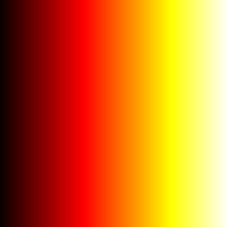

## dip::hot
hot 颜色表（已变为内置函数）

  

## 简介
[ `c = dip::hot`](#function1)  
[ `c = dip::hot(m)`](#function2)

## 用法

c = dip::hot 以 N×3 的数值矩阵形式返回对应的 hot 颜色表，其中 N 取决于当前图形上下文：若存在图窗，则 N 等于该图窗颜色图的长度；若无图窗，则采用默认长度 256。矩阵的每一行对应一个颜色采样点，按列顺序存储该点的红色、绿色和蓝色强度分量，所有强度值均归一化至 [0, 1] 区间。具体的颜色渐变趋势如下图所示。  
  

c = dip::hot([m](#Q1)) 返回包含 `m` 种颜色的颜色表。

## 参数说明
### 输入参数
** m — 颜色数**  
256（默认）| 非负整数

颜色数，指定为非负整数。`m` 的值为当前图窗的颜色表中的颜色数。

**数据类型：** `single` | `double` | `int8` | `int16` | `int32` | `int64` | `uint8` | `uint16` | `uint32` | `uint64` |

## 版本历史
在北太天元图像处理工具箱 V2.0 推出

<!-- ## 相关主题
<a href="../colormap/colormap.html">colormap</a>  -->