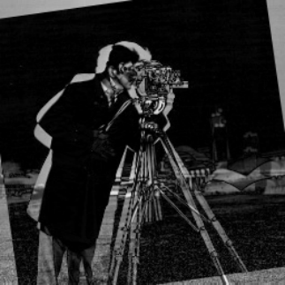

## imshowpair
将 2 幅图像合成显示

## 简介
[`obj = imshowpair(A, B)`](#function1)  
[`obj = imshowpair(A, RA, B, RB)`](#function2)  
[`obj = imshowpair(___, method)`](#function3)  
[`obj = imshowpair(___, Name, Value)`](#function4)

## 用法 
 [obj](#P1) = imshowpair([A](#Q1), [B](#Q2)) 返回一个合成 RGB 图像 `obj`，以不同色带叠加显示 `A` 和 `B`。若两图尺寸不一致，`imshowpair` 会自动在较小图像的右侧与下侧进行零填充以实现两个图像大小相同。默认情况下，两幅图像的强度值独立进行归一化缩放。  
 [obj](#P1) = imshowpair([A](#Q1), [RA](#Q3), [B](#Q2), [RB](#Q4)) 使用 `RA` 和 `RB` 中提供的空间参照信息，显示图像 `A` 和 `B` 之间的差异。`RA` 和 `RB` 是空间参照对象。  
 [obj](#P1) = imshowpair(\_\_\_, [method](#Q5)) 通过 `method` 参数指定融合可视化方法。  
 [obj](#P1) = imshowpair(\_\_\_, [Name, Value](#Q6)) 支持任何上述语法，且可使用一个或多个名称-值参数对指定其他附加项。

## 参数说明
### 输入参数
** A — 要显示的图像**  
灰度图像 | 真彩色图像 | 二值图像

要显示的图像，指定为灰度、真彩色或二值图像。

** B — 要显示的图像**  
灰度图像 | 真彩色图像 | 二值图像

要显示的图像，指定为灰度、真彩色或二值图像。

** RA — 关于输入图像的空间参照信息**  
空间参照对象

关于输入图像的空间参照信息，指定为空间参照对象，属于 `imref2d` 类。

** RB — 关于输入图像的空间参照信息**  
空间参照对象

关于输入图像的空间参照信息，指定为空间参照对象，属于 `imref2d` 类。

** method — 显示组合图像的可视化方法**  
"falsecolor"（默认）| "blend" | "diff" | "montage"

显示组合图像的可视化方法，指定为以下值之一。

| **值**         | **描述**                                                                                                                                                                                        | 
| :------------- | :---------------------------------------------------------------------------------------------------------------------------------------------------------------------------------------------- | 
| "falsecolor"   | 用不同色带叠加 `A` 和 `B`。灰色区域表示图像具有相同强度的位置。彩色区域表示图像强度值不同的位置。也可以选择使用 ColorChannels 参量指定显示颜色。该函数将 RGB 图像转换为灰度，然后以假彩色显示。 |
| "blend"        | 使用 Alpha 混合叠加 `A` 和 `B`。显示的强度是两个图像的均值。                                                                                                                                    | 
| "checkerboard" | 使用来自 `A` 和 `B` 的交替矩形区域显示图像。                                                                                                                                                    |
| "diff"         | 显示 `A` 和 `B` 的差异图像。该函数在计算差异图像之前会将 RGB 图像转换为灰度图像。                                                                                                                 |          |
| "montage"      | 将 `A` 和 `B` 在同一图窗中并排放置。                                                                                                                                                            | 

**数据类型：**`char` | `string`

###  名称-值参数
将可选的参量对组指定为Name1, Value1, ... , NameN, ValueN，其中 Name 是参量名称，Value 是对应的值。名称-值参量必须出现在其他参量后，但对各个参量对组的顺序没有要求。  
示例："Scaling","joint" 将 `A` 和 `B` 的强度值作为一个单一数据集一起缩放。

**ColorChannels — 每个输入图像的输出颜色通道**  
"green-magenta"（默认）| [R G B] | "red-cyan"

每个输入图像的输出颜色通道，指定为下表中的值之一。当 [method](#Q5) 指定为 "falsecolor" 时，此参量仅影响可视化。

| **选项**        | **描述**                                                                                                                                                  |
| :-------------- | :-------------------------------------------------------------------------------------------------------------------------------------------------------- |
| [R G B]         | 三元向量，用于指定合成图像中红、绿、蓝三个输出通道分别对应哪个输入图像。R、G、B的取值为 1（应用于第一个输入图像）、2（应用于第二个输入图像）和0（不应用于任何输入图像）。 |
| "red-cyan"      | 向量 [1 2 2] 的快捷方式，适用于红色/青色立体浮雕。                                                                                                        |
| "green-magenta" | 向量 [2 1 2] 的快捷方式，这是高对比度选项，非常适合多种颜色色盲患者。                                                                                     | -->

**Interpolation — 插值方法**  
"nearest"（默认）| "bilinear"

缩放图像时使用的插值方法，指定为以下值之一。

| **方法**   | **描述**               |
| :--------- | :--------------------- |
| "nearest"  | 最近邻点插值（默认值） |
| "bilinear" | 双线性插值             |

<!-- **Parent — 图像对象的父级**  
坐标区对象 

由 imshowpair 创建的图像对象的父级，指定为坐标区对象。-->

**Scaling — 强度缩放选项**  
"independent"（默认）| "joint" | "none"

强度缩放选项，指定为下列值之一。

| **选项**      | **描述**                                                                                                                                                   |
| :------------ | :--------------------------------------------------------------------------------------------------------------------------------------------------------- |
| "independent" | 彼此独立地缩放 `A` 和 `B` 的强度值。                                                                                                                       |
| "joint"       | 将两幅图像视为同一数据整体进行强度归一化。 该模式特别适用于单模态图像的配准可视化：如果一个图像包含的填充值在另一个图像的动态范围之外，联合缩放可有效抑制填充值对全局对比度的干扰，确保有效区域获得最佳可视化对比。|
| "none"        | 不进行缩放。                                                                                                                                               |

### 输出参数
** obj — 两个图像的可视化**  
图像对象

两个图像的可视化，返回为一个图像对象。

## 版本历史
在北太天元图像处理工具箱 V1.0 推出

## 相关主题
<a href="../imfuse/imfuse.html">imfuse</a> | <a 
href="../imblend/imblend.html">imblend</a> | <a 
href="../imregister/imregister.html">imregister</a> | <a 
href="../imshow/imshow.html">imshow</a> | <a 
href="../montage/montage.html">montage</a> 
<!-- | <a 
href="../imtransform/imtransform.html">imtransform</a>  -->