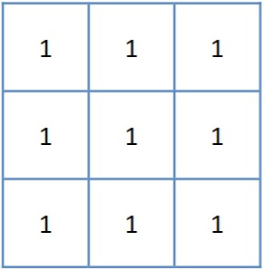

## ordfilt2
二维顺序统计量滤波

## 简介
[ `B = ordfilt2(A, order, domain)`](#function1)  
[ `B = ordfilt2(___, padopt)`](#function2)

## 用法

[B](#Q5) = ordfilt2([A](#Q1), [order](#Q2), [domain](#Q3)) 将 `A` 中的每个元素替换为由 `domain` 中的非零元素指定的相邻元素的有序集中的第 `order` 个元素。  

[B](#Q5) = ordfilt2(___, [padopt](#Q4)) 对 [`A`](#Q1) 进行滤波，其中 `padopt` 指定 `ordfilt2` 如何填充矩阵边界。

## 参数说明
### 输入参数
**A — 要滤波的数据**  
二维逻辑数组 | 二维数值数组

要滤波的数据，指定为二维逻辑矩阵或二维数值矩阵。

**数据类型：** `single` | `double` | `int8` | `int16` | `int32` | `uint8` | `uint16` | `uint32` | `logical`

**order — 用来替换目标像素的元素**  
正整数

用来替换目标像素的元素，指定为实整数标量。

**数据类型：** `double`

**domain — 邻域**  
二维逻辑矩阵 | 二维数值矩阵

邻域，指定为包含 1 和 0 的数值或逻辑矩阵。`domain` 等效于用于二值图像运算的结构元素，1 值元素定义滤波运算的邻域，下表列出一些常见滤波器的示例：
<!-- 处理一下图片的引用问题 -->
| **滤波运算类型** | **示例代码** | **邻域**|
|:--|:--|:--|
| 中位数滤波器 |B = ordfilt2(A, 5, ones(3,3))| |
| 最小值滤波器 |B = ordfilt2(A, 1, ones(3,3))| |
| 最大值滤波器 |B = ordfilt2(A, 9, ones(3,3))| |
| 北、东、南、西邻点的最小值 | B = ordfilt2(A,1,[0 1 0; 1 0 1; 0 1 0]) | |

**数据类型：** `single` | `double` | `int8` | `int16` | `int32` | `int64` | `uint8` | `uint16`| `uint32` | `uint64` | `logical`

**padopt — 填充方法**  
"zeros"（默认）| "symmetric"

填充选项，指定为下列值之一：

| **值** | **描述** |
|:--|:--|
| "zeros" | 用 0 填充数字数据的数组。|
| "symmetric" |用自身的镜像翻转填充数组。|

**数据类型：** `char` | `string`

### 输出参数
**B — 滤波后的数据**  
二维数值矩阵 | 二维逻辑矩阵

滤波后的数据，以与输入数据 [A](#Q1) 具有相同数据类型的二维数值矩阵或二维逻辑矩阵形式返回。

## 参考文献
[1] Haralick R M, Shapiro L G. Computer and Robot Vision: Vol. 1. Reading, MA: Addison-Wesley, 1992.
[2] Huang T S, Yang G J, Tang G Y. A fast two-dimensional median filtering algorithm. IEEE transactions on Acoustics, Speech and Signal Processing, 1979, 27(1): 13-18.
## 版本历史
在北太天元图像处理工具箱 V1.0 推出 

## 相关主题
<a href="../medfilt2/medfilt2.md">medfilt2</a> 
